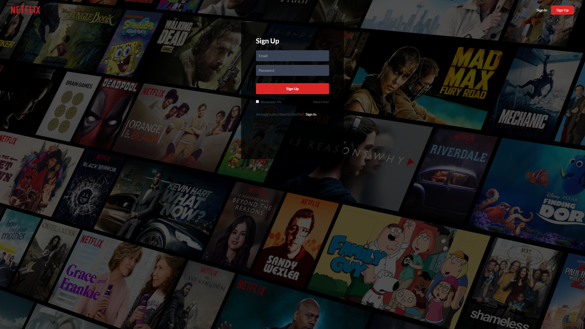
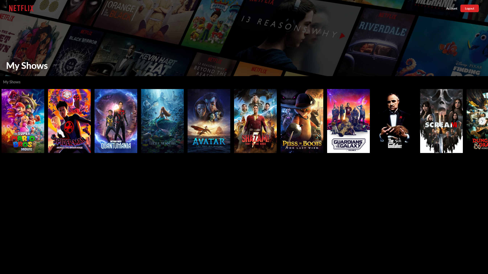
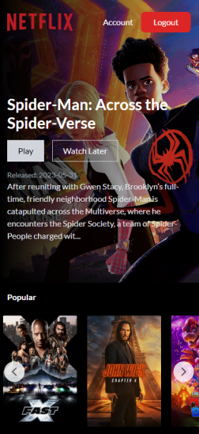
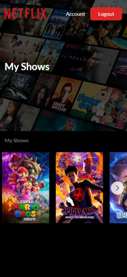
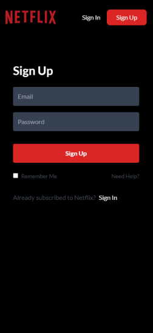

<br/>
<div align="center">
  <a href="">
    
  </a>

  <h1 align="center">Netflix Clone Website</h1>

  <p align="center">
    <a href="https://netflix-clone-react-rf.netlify.app/"><strong>Live Website »</strong></a>
    <br/>
    <br/>
  </p>
</div>

<details>
  <summary>Table of Contents</summary>
  <ol>
    <li>
      <a href="#about-project">About Project</a>
    </li>
    <li>
      <a href="#screenshots">Screenshots</a>
    </li>
    <li><a href="#tech-stack">Tech Stack</a></li>
    <li>
      <a href="#installation">Installation</a>
    </li>
  </ol>
</details>
 <br />

## About Project

Clone of Netflix website built using React JS and designed using Tailwind CSS. Website is fully responsive and uses reusable components that take certain props. Website is based on fetching data using Axios from TMDb API. All of the rows are generated by a single fetch request that gets fetch URL from Row component props. Movies placed in given categories can be scrolled through using Swiper. The website allows signing in and signing up. On top of that, signed in users can mark videos as liked and get access to the Account page, which features videos they have liked. Movies shown in the Account page can also be scrolled through using Swiper and can also get deleted from the liked movies list. All these functionalities are supported with Firebase.

## Screenshots



 
 
 


## Tech Stack

- 
- 
- 
- 
- 
- Axios
- Context API
- Swiper
- React Icons

## Installation

To get started with this project, simply clone the repository:

```bash
git clone https://github.com/Vertori/ntflx-cln-react-ts.git
```

To setup API, go to [TMDb Website](https://www.themoviedb.org/) and create an account.<br/>
Then go to Settings -> API and copy your API Key.<br/>
Create .env file in root folder.<br/>
Paste your API Key to your .env file as shown below:

```bash
VITE_MOVIE_API_KEY = 'Your API Key'
```

Create your Firebase project -> Add Firebase to your web app.<br/>
Then paste your keys from firebaseConfig to your .env file as shown below:

```bash
VITE_FIREBASE_API_KEY=YourApiKey
VITE_FIREBASE_AUTH_DOMAIN=YourAuthDomain
VITE_FIREBASE_PROJECT_ID=YourProjectId
VITE_FIREBASE_STORAGE_BUCKET=YourStorageBucket
VITE_MESSAGING_SENDER=YourMessagingSenderId
VITE_APP_ID=YourAppId
```

Use the package manager [npm](https://www.npmjs.com/) to install the dependencies:

```bash
npm install
```

After that, run the following command to start the development server:

```bash
npm run dev
```
